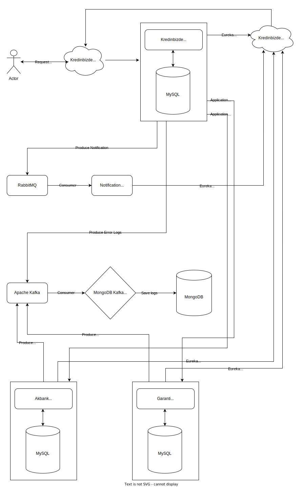

# 4.Hafta Ödevi
- Kullanılan servisleri istediğiniz bir database ile bağlayın. `(30 PUAN)`

- Bir uygulama için service katmanına tüm gerekli senaryolar için unit test yazın. `(20 PUAN)(Daha fazla yapan bonus 10 PUAN)`

- Tüm uygulamaları tek bir repo haline getirin.`(5 PUAN)`

- Dokümantasyon ekleyin. `(20 PUAN)`

- Best practices, isimlendirme kurallarına uyum. `(10 PUAN)`

- Uygulamanın doğru çalışması. `(15 PUAN)`

## BONUS
- Uygulamaların dockerize edilmesi ve docker compose dosyası yazılması. `(10 PUAN)`

- Design Pattern kullanımı. `(10 PUAN)`

---
*Eğitmen - Cem DIRMAN*  
*Kolay Gelsin*

# KredinBizde Services

Here is the general schematic for our system's architecture.

## Banks
Each bank has own service, including creating new loan and listing the loans endpoints. 

## Logs
We can collect all logs via Kafka then saved to the MongoDB.

## Notifications
We have a basic notification service that consumes the queue on the RabbitMQ. 